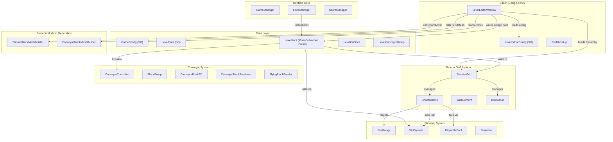
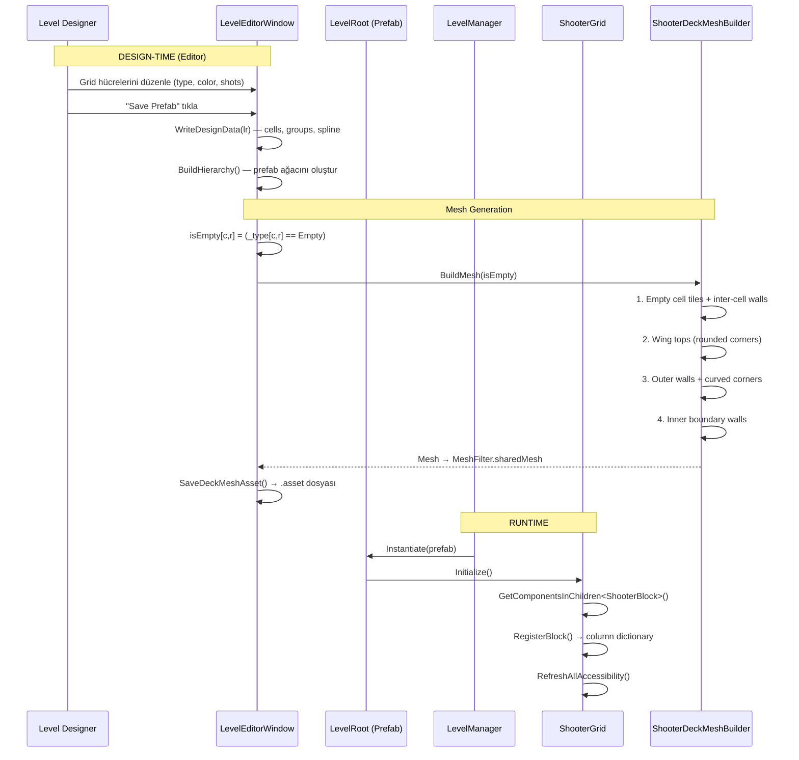

# Block Shooter — Architecture Analysis Report

---

## A. Project Architecture Overview



### Dosya Yapısı

| Dizin | İçerik |
|-------|--------|
| `Scripts/Core/` | GameManager, LevelManager, LevelRoot, GameBootstrap, ScoreManager, ObjectPool |
| `Scripts/Data/` | GameConfig, LevelData, LevelEditorConfig, BlockColorType, BoosterData |
| `Scripts/Blocks/` | ShooterBlock, ShooterGrid, WallElement, ConveyorBlock3D |
| `Scripts/Grid/` | **ShooterDeckMeshBuilder** — tek dosya, prosedürel deck mesh üretimi |
| `Scripts/Track/` | ConveyorTrackMeshBuilder, ConveyorTrackRenderer, ConveyorController, BlockGroup, FlyingBlockFeeder |
| `Scripts/Shooting/` | FireRange, Projectile, ProjectilePool, SlotSystem |
| `Scripts/LevelEditor/` | LevelEditorWindow (~1894 satır), PrefabSetup |
| `Scripts/Door/` | BlockDoor |
| `Data/Levels/` | Kaydedilmiş level prefab'ları (Level_001.prefab vb.) |

---

## B. Important Scripts and Responsibilities

### B.1 Level Design & Data

#### [LevelEditorWindow.cs](file:///c:/Users/ekrm_/OneDrive/Belgeler/GitHub/DodoGames/block-shooter/Assets/Project%20Files/Game/Scripts/LevelEditor/LevelEditorWindow.cs)
- **~1894 satır** — projenin en büyük dosyası
- Unity EditorWindow: sol panel (level listesi), orta panel (spline/grid/group düzenleme), sağ panel (cell inspector)
- Grid boyutlarını (`_gridCols × _gridRows`) ve her hücreyi (`GridCellType`, `BlockColorType`, shot count, door count) yönetir
- Spline düzenleme (preset'ler, knot ekleme/silme, tangent mode'lar)
- `SavePrefab()` — tüm hiyerarşiyi sıfırdan oluşturur:
  1. `WriteDesignData(lr)` → LevelRoot'a metadata yazar
  2. `BuildHierarchy()` → Track, FireRange, SlotDeck, ShooterGrid, ShooterDeck oluşturur
  3. `SaveDeckMeshAsset()` / `SaveTrackMeshAsset()` → mesh'leri `.asset` olarak kaydeder

#### [LevelRoot.cs](file:///c:/Users/ekrm_/OneDrive/Belgeler/GitHub/DodoGames/block-shooter/Assets/Project%20Files/Game/Scripts/Core/LevelRoot.cs)
- Level prefab'ının root component'ı
- `LevelGridCell` listesi: `(col, row, type, color, shotCount, doorCount)`
- `LevelConveyorGroup` listesi: `(color, rowCount, laneCount)`
- Spline verileri: `splineKnots`, `splineTangentsIn/Out`, `splineTangentModes`
- `Initialize()` — ConveyorController, ShooterGrid, SlotSystem'ı başlatır

#### [LevelEditorConfig.cs](file:///c:/Users/ekrm_/OneDrive/Belgeler/GitHub/DodoGames/block-shooter/Assets/Project%20Files/Game/Scripts/Data/LevelEditorConfig.cs)
- ScriptableObject — tüm level editor ayarları
- Prefab referansları (shooterBlock, wallElement, conveyorBlock, slotIndicator, trackSegment, arrow, fireRange, ground)
- Grid varsayılanları: `gridCellSize = 1.2f`, `defaultShots = 100`
- **Shooter Deck parametreleri**: `sideWingWidth`, `backDepth`, `deckTileHeight`, `bevelSize`, `bevelSegments`
- Deck materyalleri: `deckTopMaterial` (submesh 0), `deckWallMaterial` (submesh 1)

### B.2 Grid & Block System

#### [ShooterGrid.cs](file:///c:/Users/ekrm_/OneDrive/Belgeler/GitHub/DodoGames/block-shooter/Assets/Project%20Files/Game/Scripts/Blocks/ShooterGrid.cs)
- Singleton: pre-placed ShooterBlock çocuklarını yönetir
- Sütun bazlı erişilebilirlik kuralı: her sütundaki en öndeki blok erişilebilir
- FreePick booster: tüm blokları erişilebilir yapar
- `AddBlock()` ile runtime'da dinamik blok spawn'u (BlockDoor'dan)

#### [ShooterBlock.cs](file:///c:/Users/ekrm_/OneDrive/Belgeler/GitHub/DodoGames/block-shooter/Assets/Project%20Files/Game/Scripts/Blocks/ShooterBlock.cs)
- Grid'deki tek bir atıcı blok
- Yaşam döngüsü: `InGrid → MovingToSlot → InSlot (auto-shoot) → Depleted`
- Serialized alanlar: `_colorType`, `_shotCount`, `_gridColumn`, `_gridRow`
- `EditorSetup()` — Level Editor tarafından prefab'a renk/shot/pozisyon yazılır

#### [WallElement.cs](file:///c:/Users/ekrm_/OneDrive/Belgeler/GitHub/DodoGames/block-shooter/Assets/Project%20Files/Game/Scripts/Blocks/WallElement.cs)
- **Marker component** — grid'deki boş hücreleri temsil eder
- Gameplay mantığı yok; sadece `_gridColumn` ve `_gridRow` tutar
- Boş hücre prefab'ı olarak instantiate edilir

#### [BlockColorType.cs](file:///c:/Users/ekrm_/OneDrive/Belgeler/GitHub/DodoGames/block-shooter/Assets/Project%20Files/Game/Scripts/Data/BlockColorType.cs)
- Enum: `None=0, Red=1, Blue=2, Green=3, Yellow=4, Purple=5, Orange=6`

### B.3 Procedural Mesh Generation

#### [ShooterDeckMeshBuilder.cs](file:///c:/Users/ekrm_/OneDrive/Belgeler/GitHub/DodoGames/block-shooter/Assets/Project%20Files/Game/Scripts/Grid/ShooterDeckMeshBuilder.cs) — ⭐ CRITICAL
- **275 satır** — grid'in platform mesh'ini prosedürel oluşturur
- Parametreler: `gridCols`, `gridRows`, `cellSize`, `sideWingWidth`, `backDepth`, `tileHeight`, `bevelSize`, `bevelSegments`
- `BuildMesh(bool[,] isEmpty)` — tek entry point
- **2 submesh**:
  - Submesh 0 = Top faces (üst yüzey)
  - Submesh 1 = Wall faces (yan duvarlar)
- 4 aşamalı geometri üretimi:
  1. **Empty cell tiles + inter-cell walls** — boş hücrelere üst yüzey, dolu komşulara duvar
  2. **Wing tops** — grid'in sol/sağ/arka uzantıları (rounded corners)
  3. **Outer walls** — dış kenar duvarları + köşe eğrileri
  4. **Inner boundary walls** — grid ile kanatlar arasındaki sınır duvarları (bevel ile)

#### [ConveyorTrackMeshBuilder.cs](file:///c:/Users/ekrm_/OneDrive/Belgeler/GitHub/DodoGames/block-shooter/Assets/Project%20Files/Game/Scripts/Track/ConveyorTrackMeshBuilder.cs)
- **439 satır** — kapalı spline boyunca profil sweep'i
- 12 vertex'li 2D profil: sol duvar → belt → sağ duvar (alt açık)
- Chamfer bevel'ler profil noktalarında tanımlı
- Open zone (FireRange alanı) — sağ duvar'ın bir kısmı kesilir
- 2 submesh: Wall (submesh 0), Belt (submesh 1)

### B.4 Runtime Systems

| Script | Sorumluluk |
|--------|------------|
| [GameManager](file:///c:/Users/ekrm_/OneDrive/Belgeler/GitHub/DodoGames/block-shooter/Assets/Project%20Files/Game/Scripts/Core/GameManager.cs) | Game state (Idle/Playing/Win/Fail), event'ler |
| [LevelManager](file:///c:/Users/ekrm_/OneDrive/Belgeler/GitHub/DodoGames/block-shooter/Assets/Project%20Files/Game/Scripts/Core/LevelManager.cs) | Level prefab instantiation, level progression |
| [GameConfig](file:///c:/Users/ekrm_/OneDrive/Belgeler/GitHub/DodoGames/block-shooter/Assets/Project%20Files/Game/Scripts/Data/GameConfig.cs) | Fire rate, projectile speed, renk materyalleri, skor |

---

## C. Data Flow: Level → Grid → Mesh



### Adım Adım Detay

**1. Design-Time (Level Editor)**
- Level Editor grid'i `GridCellType[,]` olarak tutar: `Empty`, `ShooterBlock`, `Door`
- Her hücre için: `BlockColorType`, `shotCount`, `doorCount`
- "Save Prefab" → `BuildHierarchy()` çağrılır

**2. BuildHierarchy() İçinde Hücre İşleme** ([LevelEditorWindow.cs:1683-1722](file:///c:/Users/ekrm_/OneDrive/Belgeler/GitHub/DodoGames/block-shooter/Assets/Project%20Files/Game/Scripts/LevelEditor/LevelEditorWindow.cs#L1683-L1722))
```
For each cell (c, r):
├── ShooterBlock → PrefabUtility.InstantiatePrefab(shooterBlockPrefab)
│                  → EditorSetup(color, shots, col, row)
├── Door         → AddComponent<BlockDoor>()
└── Empty        → PrefabUtility.InstantiatePrefab(wallElementPrefab)
                    → WallElement.SetGridPosition(c, r)
```

**3. Deck Mesh Generation** ([LevelEditorWindow.cs:1724-1747](file:///c:/Users/ekrm_/OneDrive/Belgeler/GitHub/DodoGames/block-shooter/Assets/Project%20Files/Game/Scripts/LevelEditor/LevelEditorWindow.cs#L1724-L1747))
```csharp
// isEmpty boolean array'i oluşturulur
var isEmpty = new bool[_gridCols, _gridRows];
for (int c = 0; c < _gridCols; c++)
for (int r = 0; r < _gridRows; r++)
    isEmpty[c, r] = _type[c, r] == GridCellType.Empty;

// ShooterDeckMeshBuilder'a parametreler atanır
deckBuilder.gridCols      = _gridCols;
deckBuilder.gridRows      = _gridRows;
deckBuilder.cellSize      = cs;           // LevelEditorConfig.gridCellSize
deckBuilder.tileHeight    = _cfg.deckTileHeight;
deckBuilder.sideWingWidth = _cfg.sideWingWidth;
deckBuilder.backDepth     = _cfg.backDepth;
deckBuilder.bevelSize     = _cfg.bevelSize;
deckBuilder.bevelSegments = _cfg.bevelSegments;

// Mesh üretilir
deckBuilder.BuildMesh(isEmpty);
```

**4. Runtime Initialization**
- `LevelManager.SpawnLevel()` → `Instantiate(prefab)` → `LevelRoot.Initialize()`
- ShooterGrid çocuk ShooterBlock'ları tarar → `RegisterBlock()` → column-based accessibility
- Deck mesh **runtime'da yeniden üretilmez** — prefab'a baked

---

## D. Systems Affected by Procedural Bevel Generation

> [!IMPORTANT]
> Prosedürel bevel eklenmesi aşağıdaki sistemleri doğrudan veya dolaylı etkiler:

### Doğrudan Etkilenen

| Sistem | Dosya | Etki |
|--------|-------|------|
| **ShooterDeckMeshBuilder** | [ShooterDeckMeshBuilder.cs](file:///c:/Users/ekrm_/OneDrive/Belgeler/GitHub/DodoGames/block-shooter/Assets/Project%20Files/Game/Scripts/Grid/ShooterDeckMeshBuilder.cs) | Ana hedef — bevel geometrisi burada üretilmeli. `AddTop`, `AddWallX/Z`, `AddCornerFan`, `AddCurvedWall` fonksiyonları değişecek veya yeni helper'lar eklenecek |
| **LevelEditorConfig** | [LevelEditorConfig.cs](file:///c:/Users/ekrm_/OneDrive/Belgeler/GitHub/DodoGames/block-shooter/Assets/Project%20Files/Game/Scripts/Data/LevelEditorConfig.cs) | Yeni bevel parametreleri eklenebilir (örn: edge bevel size, profile curve) |
| **LevelEditorWindow** | [LevelEditorWindow.cs:1724-1747](file:///c:/Users/ekrm_/OneDrive/Belgeler/GitHub/DodoGames/block-shooter/Assets/Project%20Files/Game/Scripts/LevelEditor/LevelEditorWindow.cs#L1724-L1747) | Yeni parametreleri deckBuilder'a aktarması gerekir |

### Dolaylı Etkilenen

| Sistem | Dosya | Etki |
|--------|-------|------|
| **Kayıtlı Mesh Asset'leri** | `Models/LevelMesh/*_DeckMesh.asset` | Tüm mevcut level'ların deck mesh'leri yeniden "Save Prefab" ile rebuild edilmeli |
| **Materyaller** | `deckTopMaterial`, `deckWallMaterial` | Eğer bevel yeni bir submesh olarak eklenirse (3. submesh), ek materyal gerekir |
| **ConveyorTrackMeshBuilder** | [ConveyorTrackMeshBuilder.cs](file:///c:/Users/ekrm_/OneDrive/Belgeler/GitHub/DodoGames/block-shooter/Assets/Project%20Files/Game/Scripts/Track/ConveyorTrackMeshBuilder.cs) | Referans mimari — benzer bevel tekniği (chamfer profil) zaten burada var |
| **ShooterBlock'ların fiziksel pozisyonları** | Dolaylı | Bevel eğer hücre boyutlarını daraltırsa, blok yerleşimleri kayabilir |

---

## E. Risks of Modifying ShooterDeckMeshBuilder

### 🔴 Yüksek Risk

1. **Vertex/Triangle Index Kırılması**
   - Mevcut geometri, submesh 0 (top) ve submesh 1 (wall) olarak ayrılmış. Bevel kenarları hangi submesh'e ait olacak? Yanlış atama materyal hatalarına yol açar.
   - `AddTop`, `AddWallX/Z` ve `AddCornerFan` arasındaki vertex index sıralaması çok hassas — yeni vertex'ler eklemek winding order'ı bozabilir.

2. **Inter-Cell Wall Logic Karmaşıklığı** ([L54-68](file:///c:/Users/ekrm_/OneDrive/Belgeler/GitHub/DodoGames/block-shooter/Assets/Project%20Files/Game/Scripts/Grid/ShooterDeckMeshBuilder.cs#L54-L68))
   - Duvarlar komşuluk kontrolüne dayalı: `if (!E(c-1, r))` → sol komşu dolu ise duvar ekle. Bevel eklemek bu mantığı karmaşıklaştırır çünkü dolu ve boş hücrelerin kenarlarında farklı geometri gerekir.

3. **Inner Boundary Walls + Corner Bevel Etkileşimi** ([L98-137](file:///c:/Users/ekrm_/OneDrive/Belgeler/GitHub/DodoGames/block-shooter/Assets/Project%20Files/Game/Scripts/Grid/ShooterDeckMeshBuilder.cs#L98-L137))
   - `cornerBL` / `cornerBR` mantığı özel köşe durumlarını ele alıyor. Bevel, bu köşe radius'unu (`R`) kullanıyor — bevel boyutu değiştiğinde bu alan kırılabilir.

### 🟡 Orta Risk

4. **Normal Yeniden Hesaplama**
   - `RecalculateNormals()` kullanılıyor. Bevel yüzeyleri smooth normal gerektirirken, top/wall yüzeyleri hard edge isteyebilir. Mevcut yapıda custom normal desteği yok.

5. **Mevcut Level Prefab'ları**
   - Tüm kayıtlı level'lar mevcut mesh yapısıyla baked. Parametre eklenmesi durumunda eski prefab'lar varsayılan değerlerle çalışmalı.

6. **UV Mapping**
   - Mevcut UV'ler `(x, z)` world-space koordinatları kullanıyor (top faces) veya `(0-1, 0-1)` normalized (wall faces). Bevel yüzeyleri için UV stratejisi belirlenmeli.

### 🟢 Düşük Risk

7. **Performance** — Mobil platform, mesh vertex sayısı artışı dikkatle kontrol edilmeli ancak mevcut mesh basit (birkaç yüz vertex).

8. **Editor Custom Inspector** — Mevcut custom editor sadece "Rebuild (all empty)" butonu içeriyor, bevel parametreleri zaten Inspector'da gösteriliyor.

---

## F. Unclear Areas Requiring Further Inspection

### ❓ 1. WallElement Prefab'ının Görsel İçeriği
- [WallElement.cs](file:///c:/Users/ekrm_/OneDrive/Belgeler/GitHub/DodoGames/block-shooter/Assets/Project%20Files/Game/Scripts/Blocks/WallElement.cs) sadece marker component. `wallElementPrefab` referansı LevelEditorConfig'de tanımlı ama prefab'ın mesh/renderer/collider yapısı `.prefab` dosyası incelenmeden bilinmiyor. **Boş hücrelere hem WallElement prefab'ı hem de deck mesh geometrisi mi ekleniyor?** Muhtemelen evet — WallElement sadece marker, deck mesh üst yüzeyi sağlıyor.

### ❓ 2. Deck Mesh ile ShooterBlock Pozisyon Hizalaması
- [BuildHierarchy](file:///c:/Users/ekrm_/OneDrive/Belgeler/GitHub/DodoGames/block-shooter/Assets/Project%20Files/Game/Scripts/LevelEditor/LevelEditorWindow.cs#L1672-L1678) ShooterGrid'i `(0, 0, gridZ)` pozisyonuna koyuyor ve blokları `(-hw + c*cs, 0, -hd + r*cs)` local offset'le yerleştiriyor.
- [ShooterDeckMeshBuilder](file:///c:/Users/ekrm_/OneDrive/Belgeler/GitHub/DodoGames/block-shooter/Assets/Project%20Files/Game/Scripts/Grid/ShooterDeckMeshBuilder.cs#L28-L38) ise `gHW = gridCols * cellSize * 0.5f` kullanıyor — bu grid merkezinden hesaplar.
- **Soru**: ShooterGrid'deki `hw = (_gridCols - 1) * cs * 0.5f` ile DeckMeshBuilder'daki `gHW = gridCols * cellSize * 0.5f` **farklı hesaplamalar**. Grid `gridCols-1` boşluk kullanırken, deck `gridCols` hücre genişliği kullanıyor. Bu kasıtlı (deck, hücrelerin kenarlarından başlıyor) ama bevel eklerken dikkat gerektirir.

### ❓ 3. ConveyorTrackMeshBuilder ile Tutarlılık
- Track mesh'te bevel `profile` dizisinde tanımlı (P2-P3, P8-P9 chamfer noktaları). Deck mesh'te ise `bevelSize` ve `bevelSegments` parametreleri var ama **sadece dış köşeler ve inner boundary köşeleri** bevel'leniyor. Cell-to-cell kenarlarında (inter-cell walls) bevel yok. Bu kasıtlı mı?

### ❓ 4. Runtime Rebuild Senaryosu
- `ShooterDeckMeshBuilder` runtime'da `Awake()`'te sadece `_mf` ataması yapıyor, `BuildMesh()` çağırmıyor. Mesh tamamen editor-time'da baked. **Hiç runtime rebuild senaryosu var mı?** (Örneğin bloklar hareket ettikçe deck değişir mi?) Mevcut kodda yok — ancak `BlockDoor` sistemi runtime'da blok spawn ediyor, deck buna tepki vermiyor.

### ❓ 5. cellSize Hardcoded Değer
- [ShooterGrid.AddBlock()](file:///c:/Users/ekrm_/OneDrive/Belgeler/GitHub/DodoGames/block-shooter/Assets/Project%20Files/Game/Scripts/Blocks/ShooterGrid.cs#L153) `const float cellSize = 1.2f` hardcoded. `LevelEditorConfig.gridCellSize` de `1.2f`. Eğer bu değer değişirse iki yer senkronize edilmeli.

### ❓ 6. 3. Submesh İhtiyacı
- Eğer bevel kenarları top veya wall materyalinden farklı bir materyalle render edilecekse, 3. submesh gerekir. Bu durumda:
  - `ShooterDeckMeshBuilder.BuildMesh()` güncellenmeli
  - `LevelEditorWindow.BuildHierarchy()` güncellenmeli (materyal array'i)
  - `LevelEditorConfig`'e `deckBevelMaterial` eklenmeli

### ❓ 7. Mevcut Bevel Davranışı
- Mevcut `bevelSize = 0.3f` ve `bevelSegments = 6` **sadece dış köşeler** (wing corners) ve **inner boundary köşeler** (`cornerBL`, `cornerBR`) için geçerli. İç hücreler arası düz duvarların kenarlarında bevel yok. Bu mevcut davranış kabul edilebilir mi, yoksa tüm kenarlar bevel'lenmeli mi?

---

## Özet Tablo

| Katman | Anahtar Dosya | Satır | Sorumluluk |
|--------|--------------|-------|------------|
| Editor | LevelEditorWindow.cs | 1894 | Level tasarım GUI, prefab üretimi |
| Config | LevelEditorConfig.cs | 67 | Deck parametreleri, prefab referansları |
| Data | LevelRoot.cs | 64 | Level metadata, cell/group/spline verileri |
| Mesh | **ShooterDeckMeshBuilder.cs** | 275 | **Prosedürel deck geometrisi** |
| Mesh | ConveyorTrackMeshBuilder.cs | 439 | Prosedürel track geometrisi (profil sweep) |
| Grid | ShooterGrid.cs | 191 | Runtime blok yönetimi |
| Block | ShooterBlock.cs | 449 | Tek blok yaşam döngüsü |
| Marker | WallElement.cs | 24 | Boş hücre marker'ı |
