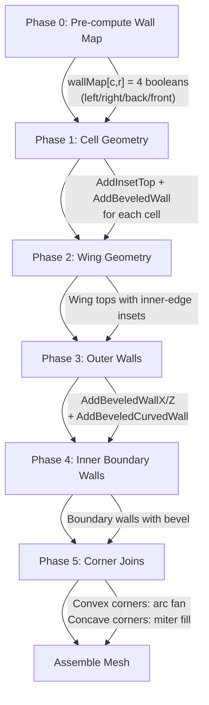

# Procedural Bevel System — Engineering Design Document

---

## Terminology

| Term | Definition |
|------|-----------|
| **Wall-top edge** | The horizontal line where a vertical wall face meets the horizontal top surface at `y = yT`. This is a sharp 90° dihedral edge. |
| **Cross-section bevel** | A chamfer or fillet in the **Y-profile** (side view) that replaces the sharp 90° wall-top edge with an angled or curved transition. This is distinct from the existing **XZ corner rounding** (`bevelSize`/`bevelSegments`). |
| **Inset** | The horizontal distance that the top surface is pulled back from the wall plane to make room for the bevel strip. |
| **bW** | Bevel width — the size of the bevel in world units (equivalent to `bevelSize` in Blender). |
| **bS** | Bevel segments — number of subdivisions in the bevel arc (1 = flat chamfer, 4+ = smooth round). |
| **Contour** | The closed polyline formed by all wall-top edges around a connected empty region. |

---

## 1. Edge Classification: Bevel Candidates

### 1.1 Edges That SHOULD Be Beveled

Every wall-top edge is a bevel candidate. These occur at the intersection of `y = yT` between a **top face** (submesh 0, normal +Y) and a **wall face** (submesh 1, normals ±X or ±Z).

```
Category                    Generated By                      Location
─────────────────────────── ──────────────────────────────── ─────────────────────────
A. Inter-cell walls         AddWallX / AddWallZ (Phase 1)    Between empty & filled cells
B. Outer straight walls     AddWallX / AddWallZ (Phase 3)    Left, right, back perimeter
C. Outer curved walls       AddCurvedWall (Phase 3)          4 outer rounded corners
D. Inner boundary walls     AddWallX / AddWallZ (Phase 4)    Grid edge ↔ wing junction
E. Inner boundary curves    AddCurvedWall (Phase 4)          cornerBL / cornerBR arcs
F. Front edge (grid→slot)   Implicit (zFront)                Front-most row → slot area
```

> [!IMPORTANT]
> **Category A (inter-cell walls)** is the most complex because the wall pattern varies per level. All other categories have fixed/predictable topology.

### 1.2 Edges That Should NEVER Be Beveled

```
Edge Type                           Reason
─────────────────────────────────── ──────────────────────────────────────────
Wall-BOTTOM edges (y = yB)          Never visible from the top-down camera angle
Top-to-top coplanar joins           Same plane, no dihedral — bevel is meaningless
Wing internal rectangle seams       Construction artifacts, not real edges
Bottom face edges                   No bottom face exists (open mesh)
```

### 1.3 Edge Diagram (Cross-Section View)

Current mesh — sharp 90° at wall-top:

```
                  Top Surface (y = yT)
    ═══════════════════════════════════╗
                                      ║  Wall
                                      ║  (y: yT → yB)
                                      ║
                                      ╚══ (y = yB, not visible)
```

Target mesh — with bevel at wall-top:

```
                  Top Surface (y = yT)
    ══════════════════════════════╗
                        inset: bW ╲
                                   ╲  Bevel Strip
                                    ╲ (N segments)
                                     ║
                                     ║  Wall
                                     ║  (y: yT-bW → yB)
                                     ║
                                     ╚══ (y = yB, not visible)
```

With multiple segments (N = 4):

```
    ══════════════════════════════╗
                                  ╲─── segment 0
                                   ╲── segment 1
                                    ╲─ segment 2
                                     ║─ segment 3
                                     ║
                                     ║  Wall (shortened)
                                     ║
```

---

## 2. Edges That Should NEVER Be Beveled

Already covered in 1.2. Additionally:

| Edge | Clarification |
|------|--------------|
| **Existing XZ corner arcs** (AddCornerFan/AddCurvedWall) | These are **plan-view** rounded corners. The cross-section bevel is **orthogonal** to them. Both systems coexist: XZ rounding handles the deck outline shape, Y-profile bevel handles the wall-top softening. The bevel should FOLLOW these curves (see Section 7). |
| **Wing-to-wing internal seams** | Where `AddTop` rectangles meet within the wing region — these are construction seams on the same Y plane, not real edges. |

---

## 3. Bevel Generation Approach Analysis

### 3A. During Wall Generation (Integrated)

Each wall primitive (`AddWallX`, `AddWallZ`, `AddCurvedWall`) is modified to:
1. Start the wall at `yT - bW` instead of `yT`
2. Emit a bevel strip from `(wallPlane, yT)` curving to `(wallPlane + inset, yT - bW)`
3. The corresponding top face is reduced by the inset amount

```
Current call:
  AddWallX(v, u, t, cx[c], cz[r], cz[r+1], yT, yB, false)
  AddTop  (v, u, t, cx[c], cx[c+1], cz[r], cz[r+1], yT)

Becomes:
  AddBeveledWallX(v, u, tBevel, tWall, cx[c], cz[r], cz[r+1], yT, yB, bW, bS, false)
  AddTop         (v, u, tTop,   cx[c]+bW, cx[c+1], cz[r], cz[r+1], yT)
                        ↑ inset by bW on the wall side
```

**Pros:**
- Each wall knows its own orientation → bevel direction is trivially correct
- No post-processing mesh surgery needed
- Top face insets are computed at construction time
- Consistent with `ConveyorTrackMeshBuilder` architecture (profile-based bevel)

**Cons:**
- Top face calculation becomes neighbor-dependent (must know ALL wall sides before emitting top)
- Corner joins between adjacent bevels require a separate pass
- `AddTop` can no longer be called with simple `cx[c]..cx[c+1]` bounds

### 3B. As a Post-Process

After the current mesh is built, scan for wall-top edges and:
1. Split each wall-top edge vertex into two (upper bevel point + lower wall point)
2. Inset the adjacent top-face vertices
3. Insert bevel strip triangles

**Pros:**
- Clean separation of concerns
- Existing code untouched until post-process

**Cons:**
- Requires edge detection on a flat vertex/triangle soup — expensive and fragile
- Cannot distinguish construction seams from real edges without metadata
- Vertex splitting disrupts existing index arrays
- Much more code complexity than integrated approach
- No precedent in the existing codebase

---

## 4. Recommended Approach for THIS Project

> [!IMPORTANT]
> **Integrated approach (3A)** — bevel generated during wall construction, with a pre-computation step for top face insets.

### Rationale

1. **Existing pattern match**: `ConveyorTrackMeshBuilder` already uses profile-based bevel (chamfer vertices baked into the 2D profile). The deck bevel is the same concept applied to individual wall primitives.

2. **Known geometry**: The code already knows exactly which edges are wall-top edges — they're the explicit `AddWallX`/`AddWallZ`/`AddCurvedWall` calls. No detection needed.

3. **Complexity budget**: Post-processing mesh surgery on a List-based construction is architecturally fragile. The integrated approach adds complexity to well-understood primitives.

4. **Performance**: Both approaches are editor-time only (baked into prefab). But integrated avoids a full mesh scan pass.

### Proposed Architecture



**Phase 0** is the key addition: before emitting any geometry, scan the `isEmpty` array to build a per-cell wall map. This allows `AddInsetTop` to know exactly which sides need insets.

```
wallMap[c, r] = {
    wallLeft:  !E(c-1, r),
    wallRight: !E(c+1, r),
    wallBack:  !E(c, r-1),
    wallFront: !E(c, r+1)
}
```

The top face for cell (c, r) is then:
```
x0 = cx[c]   + (wallLeft  ? bW : 0)
x1 = cx[c+1] - (wallRight ? bW : 0)
z0 = cz[r]   + (wallBack  ? bW : 0)
z1 = cz[r+1] - (wallFront ? bW : 0)
AddTop(v, u, tTop, x0, x1, z0, z1, yT)
```

---

## 5. Bevel Width Behavior

### 5.1 Parameter

New field on `ShooterDeckMeshBuilder`:
```
[Tooltip("Cross-section bevel width on wall-top edges. 0 = sharp edges.")]
public float wallBevelWidth = 0.06f;
```

Mirrored in `LevelEditorConfig`:
```
[Tooltip("Wall-top bevel width for shooter deck")]
public float deckWallBevelWidth = 0.06f;
```

> [!NOTE]
> The name `wallBevelWidth` is chosen to distinguish from the existing `bevelSize` (which is the XZ corner rounding radius). These are orthogonal parameters.

### 5.2 Clamping

```
bW = Clamp(wallBevelWidth, 0, cellSize * 0.25f)
```

- **Why `cellSize * 0.25f`?** A cell with walls on opposite sides loses `2 × bW` from its top face. At `0.25 × cellSize`, the remaining top is `0.5 × cellSize` — still visually dominant. Beyond this, the cell becomes more bevel than surface.
- If `bW = 0`, all bevel geometry is skipped → identical to current behavior (backward compatible).

### 5.3 Geometric Effect

For a wall at position `x = wallX` facing direction `+X`:

| Component | Without Bevel | With Bevel (bW) |
|-----------|--------------|-----------------|
| Top face x-extent | `wallX` to `wallX + cellSize` | `wallX + bW` to `wallX + cellSize` |
| Wall y-extent | `yT` to `yB` | `yT - bW` to `yB` |
| Bevel strip | — | Arc from `(wallX + bW, yT)` to `(wallX, yT - bW)` |

---

## 6. Bevel Segments Behavior

### 6.1 Parameter

New field:
```
[Tooltip("1 = flat chamfer, 4+ = smooth round bevel")]
public int wallBevelSegments = 3;
```

### 6.2 Arc Sampling

The bevel strip is a quarter-circle arc in the **YZ cross-section** (or **YX**, depending on wall orientation):

```
For segment k (0..bS-1):
    angle = k * (π/2) / bS
    offset_horizontal = bW × cos(angle)      // how far from wall plane
    offset_vertical   = bW × (1 - sin(angle)) // how far below yT

Point on arc = (wallPlane + offset_horizontal, yT - offset_vertical)
```

| bS = 1 | bS = 2 | bS = 4 | bS = 8 |
|--------|--------|--------|--------|
| Flat 45° chamfer | Faceted curve | Smooth arc | Very smooth |
| 1 quad per wall | 2 quads | 4 quads | 8 quads |

### 6.3 Vertex Count Impact

Per wall segment: `2 × (bS + 1)` vertices for the bevel strip (two rows of points).

Worst case estimate (4×2 grid, all cells filled except one center cell):
- 4 walls × 2(bS+1) = 8(bS+1) bevel vertices per cell
- With bS=4: 40 bevel vertices for one cell
- Entire deck: ~200-400 additional vertices for a typical level
- **Well within mobile budget** (current mesh is ~100-200 verts)

---

## 7. Corner Joins

This is the most geometrically complex part. At every grid vertex where wall-top edges meet, a **corner join** piece is needed.

### 7.1 Corner Taxonomy

At each grid vertex (intersection of cells [c,r], [c+1,r], [c,r+1], [c+1,r+1]), the bevel contour can form different shapes depending on the empty/filled pattern of surrounding cells.

> [!IMPORTANT]
> Only the cell being processed (the empty cell) matters. The corner type is determined by **which of its 4 sides have walls at this corner**.

For the **top-right corner** of empty cell (c, r):

```
Side A = right wall exists:  !E(c+1, r)
Side B = front wall exists:  !E(c, r+1)
Diagonal = diag filled:      !E(c+1, r+1)
```

#### Case 1: Convex Outside Corner (`A=true, B=true`)

Both adjacent sides have walls. The bevel from each side meets at the corner. A **quarter-circle fan** in the bevel profile fills the gap.

```
     Top (inset)
    ════════╗
             ╲  bevel (side B)
              ╲
    bevel ─────●  corner arc (quarter circle in Y-profile,
    (side A)   ║  projected along the XZ diagonal)
               ║
         Wall  ║
```

Geometry: A small **spherical patch** (or simplified as a flat triangle fan) at the corner where the two bevel arcs meet. For `bS = 1` this is a single triangle. For `bS > 1` this is a fan of `bS × bS` quads forming a quarter-sphere approximation.

**Simplification**: For mobile, a single flat triangle fan connecting the two bevel arc endpoints is sufficient. Full spherical interpolation is visually indistinguishable at `bW ≤ 0.1`.

#### Case 2: Straight Continuation (`A=true, B=false` or `A=false, B=true`)

Only one side has a wall. The bevel runs straight to the cell edge and **terminates flush** against the neighboring empty cell's top surface (which is at the same `yT` and extends all the way to the edge).

```
     Top (inset on right)        Neighbor top (no inset)
    ════════╗──────────────────────────────════
             ╲  bevel continues to cell edge
              ╲
               ║ wall continues to cell edge
```

No special corner geometry needed — the bevel strip simply runs the full length of the wall (from `cz[r]` to `cz[r+1]` or `cx[c]` to `cx[c+1]`).

#### Case 3: No Corner (`A=false, B=false, Diagonal=false`)

No walls at this corner. Both neighbors and diagonal are empty. The top surface is continuous — no corner piece needed.

#### Case 4: Concave Inside Corner (`A=false, B=false, Diagonal=true`)

Neither direct neighbor has a wall, but the **diagonal** cell is filled. This creates an inner (concave) corner where two walls from the diagonal cell's perspective meet.

```
    Cell (c,r)          Cell (c+1,r)
    ══════════          ══════════
              ╔═════════╗
              ║ FILLED  ║  Cell (c+1,r+1)
              ║diagonal ║
              ╚═════════╝
    ══════════          ══════════
    Cell (c,r+1)        (handled by other cells)
```

In this case, the wall and bevel are generated by the adjacent empty cells that border the diagonal filled cell. The current cell (c,r) does not generate wall geometry toward the diagonal — only toward direct ±1 neighbors. **No corner piece from this cell.**

However, the empty cells (c+1,r) and (c,r+1) each generate their own walls toward (c+1,r+1), and those walls create a concave corner. This concave corner needs a **small triangular fill** — a concave miter that closes the gap where two bevels meet at an inside angle.

```
                      ╔══ wall from (c+1,r)
    ─────────────╗    ║
    bevel (c,r+1) ╲   ║
                   ╲  ║
                    ╲ ║
                     ●── concave miter fill (single triangle)
                     ║╲
                     ║  ╲ bevel from (c+1,r)
                     ╚═══╲──────────────
                          wall from (c,r+1)
```

### 7.2 Corner Detection Algorithm

```
For each empty cell (c, r), for each of its 4 corners:
    Determine (sideA_hasWall, sideB_hasWall, diag_isFilled)
    
    Corner mapping:
    ┌──────────┬──────────────────────┬──────────────────────┬─────────────────┐
    │ Corner   │ Side A               │ Side B               │ Diagonal        │
    ├──────────┼──────────────────────┼──────────────────────┼─────────────────┤
    │ Top-Right│ right: !E(c+1, r)   │ front: !E(c, r+1)   │ !E(c+1, r+1)   │
    │ Top-Left │ left:  !E(c-1, r)   │ front: !E(c, r+1)   │ !E(c-1, r+1)   │
    │ Bot-Right│ right: !E(c+1, r)   │ back:  !E(c, r-1)   │ !E(c+1, r-1)   │
    │ Bot-Left │ left:  !E(c-1, r)   │ back:  !E(c, r-1)   │ !E(c-1, r-1)   │
    └──────────┴──────────────────────┴──────────────────────┴─────────────────┘
    
    Action:
    A && B         → emit convex corner arc
    A xor B        → no corner piece (bevel runs to edge)
    !A && !B && D  → emit concave miter fill (owned by ONE cell only to avoid duplication)
    !A && !B && !D → nothing
```

### 7.3 Avoiding Duplicate Corner Geometry

Convex corners are always emitted by the cell that owns both walls — only one cell can have `A && B` at a given grid vertex.

Concave corners (`!A && !B && D`) require an ownership rule to prevent two adjacent empty cells from each emitting the same miter fill. Rule: **the cell with the lower `(c, r)` lexicographic order owns the concave corner.**

### 7.4 Wing/Outer Boundary Corners

The wing and outer boundary already have XZ corner rounding via `AddCornerFan` + `AddCurvedWall`. The cross-section bevel must be applied ALONG these curved walls too.

For `AddCurvedWall`: currently extrudes from `yT` to `yB`. With bevel:
- Extrude from `yT - bW` to `yB`
- Add a **bevel ring** at the top of the curved wall (a band of quads that arcs from `(arc_point, yT)` to `(arc_point_inset, yT - bW)`)

For `AddCornerFan`: the fan's outer arc must be inset by `bW` to match the adjacent wall bevels. The area between the inset fan and the original arc is filled by the bevel ring.

---

## 8. Gameplay Alignment Preservation

### 8.1 ShooterBlock Positioning

ShooterBlocks are positioned by the Level Editor at:
```csharp
var pos = new Vector3(-hw + c * cs, 0f, -hd + r * cs);
// where hw = (gridCols - 1) * cs * 0.5f, hd = (gridRows - 1) * cs * 0.5f
```

The bevel modifies the **deck mesh geometry only** — not the ShooterBlock positions. Block centers remain at cell centers. The `bW` inset only affects the deck surface edge, not the cell center.

> [!NOTE]
> As long as `bW < cellSize * 0.25`, the block visually sits within the inset top surface with ample clearance.

### 8.2 Coordinate Systems

| System | Origin | Relevance |
|--------|--------|-----------|
| ShooterDeckMeshBuilder | Local mesh coords, centered at grid center | Bevel offsets are applied here |
| ShooterGrid | `(0, 0, gridZ)` in LevelRoot | Block positions are children of this |
| ShooterDeck | `(0, 0, gridZ)` in LevelRoot | Same as ShooterGrid |

Both ShooterGrid and ShooterDeck share the same world position (`gridZ`). The deck mesh builder uses `gHW = gridCols * cellSize * 0.5f` while ShooterGrid uses `hw = (gridCols - 1) * cellSize * 0.5f`. This is intentional:
- **Deck mesh**: grid coordinates span hücre **kenarları** → `gridCols` hücre genişliği
- **Block positions**: grid coordinates span hücre **merkezleri** → `gridCols - 1` boşluk

The bevel only modifies deck mesh coordinates. **No alignment risk.**

### 8.3 Collider Considerations

ShooterBlocks use `OnMouseDown()` for tap detection (raycast to the block's own collider). The deck mesh has no collider. **No collider interaction risk.**

---

## 9. ShooterGrid Behavior Preservation

### 9.1 Zero Impact Guarantee

`ShooterGrid` operates entirely on `ShooterBlock` component references found via `GetComponentsInChildren<ShooterBlock>()`. It has:
- No reference to `ShooterDeckMeshBuilder`
- No reference to the deck mesh or its geometry
- No spatial queries that depend on deck vertex positions

The bevel modification is purely visual (mesh geometry change). ShooterGrid's:
- ✅ Column-based accessibility — unaffected
- ✅ Block registration — unaffected
- ✅ FreePick mode — unaffected
- ✅ Dynamic block spawn (`AddBlock`) — uses hardcoded `cellSize = 1.2f`, unaffected by deck visual changes

### 9.2 WallElement Interaction

`WallElement` is a marker component on empty cell GameObjects. It stores `_gridColumn` and `_gridRow` but has no mesh or visual logic. The bevel replaces what would be the WallElement's visual representation (the deck surface above empty cells). **No interaction.**

---

## 10. LevelEditor Behavior Preservation

### 10.1 Parameter Propagation

In [LevelEditorWindow.BuildHierarchy()](file:///c:/Users/ekrm_/OneDrive/Belgeler/GitHub/DodoGames/block-shooter/Assets/Project%20Files/Game/Scripts/LevelEditor/LevelEditorWindow.cs#L1724-L1747), new parameters must be passed to `ShooterDeckMeshBuilder`:

```
// Current (lines 1733-1740):
deckBuilder.gridCols      = _gridCols;
deckBuilder.gridRows      = _gridRows;
deckBuilder.cellSize      = cs;
deckBuilder.tileHeight    = _cfg.deckTileHeight;
deckBuilder.sideWingWidth = _cfg.sideWingWidth;
deckBuilder.backDepth     = _cfg.backDepth;
deckBuilder.bevelSize     = _cfg.bevelSize;         // XZ corner rounding
deckBuilder.bevelSegments = _cfg.bevelSegments;      // XZ corner segments

// Addition:
deckBuilder.wallBevelWidth    = _cfg.deckWallBevelWidth;     // NEW
deckBuilder.wallBevelSegments = _cfg.deckWallBevelSegments;  // NEW
```

### 10.2 Config Extension

`LevelEditorConfig` gets 2 new fields under the `[Header("Shooter Deck")]` section:
```
[Tooltip("Cross-section bevel width on wall-top edges. 0 = sharp.")]
public float deckWallBevelWidth    = 0.06f;
[Tooltip("1 = flat chamfer, 4+ = smooth round bevel")]
public int   deckWallBevelSegments = 3;
```

### 10.3 No Grid Logic Changes

The Level Editor's grid logic (`_type[c,r]`, cell inspector, color palette) is completely independent of mesh generation. The `isEmpty` boolean array construction remains identical:

```csharp
isEmpty[c, r] = _type[c, r] == GridCellType.Empty;
```

### 10.4 Backward Compatibility

When `deckWallBevelWidth = 0` (or field is absent in old SO assets), the system produces **identical geometry** to the current implementation. Unity's serialization system initializes missing float fields to `0f`, so old LevelEditorConfig assets automatically get zero bevel.

### 10.5 Mesh Asset Re-baking

All existing level prefabs contain baked `*_DeckMesh.asset` files. After implementing the bevel system, each level must be re-saved via "Save Prefab" to regenerate the deck mesh with bevel geometry. This is a **one-time batch operation**, not a runtime concern.

### 10.6 Custom Editor Inspector

The existing `ShooterDeckMeshBuilder.Editor` class uses `DrawDefaultInspector()`, which automatically shows all public fields. The new `wallBevelWidth` and `wallBevelSegments` fields will appear in the inspector without any editor code changes.

---

## Appendix A: Submesh Strategy

### Option 1: Two Submeshes (Recommended)

Keep the current 2-submesh structure:
- **Submesh 0 (Top)**: All top faces + bevel strips
- **Submesh 1 (Wall)**: All wall faces (below bevel)

The bevel strip is visually part of the top surface (it curves away from the camera). Using the top material gives a smooth visual transition from the flat top into the bevel.

### Option 2: Three Submeshes

Add a dedicated bevel submesh:
- **Submesh 0 (Top)**: Inset top faces only
- **Submesh 1 (Wall)**: Wall faces
- **Submesh 2 (Bevel)**: Bevel strips

This allows a separate material for the bevel (e.g., darker shade, different roughness). However, it adds complexity and an extra draw call.

> [!TIP]
> Start with **Option 1** (bevel in top submesh). If visual differentiation is needed later, extracting to a 3rd submesh is a straightforward refactor.

---

## Appendix B: Normal Strategy

### Problem

`RecalculateNormals()` averages normals at shared vertices. For the bevel to look smooth, adjacent bevel segment vertices should share normals. But the bevel-to-top-face and bevel-to-wall transitions should have **hard edges** (sharp creases).

### Solution: Duplicated Vertices at Creases

The current code already uses this pattern — `AddTop` and `AddWallX` create separate vertices even when they share the same position. This naturally creates hard edges when `RecalculateNormals()` runs.

The bevel strip should:
1. **Share** vertices between adjacent bevel segments (within the strip) → smooth bevel curve
2. **Duplicate** vertices at the top-face boundary → hard edge between flat top and bevel start
3. **Duplicate** vertices at the wall boundary → hard edge between bevel end and vertical wall

This means each bevel strip has its own isolated vertex strip, separate from both the top face and wall vertices. `RecalculateNormals()` will compute correct smooth normals within the strip and hard edges at boundaries.

---

## Appendix C: Complete Corner Case Matrix (Inter-Cell)

For the top-right corner of empty cell (c, r), with `R = right wall`, `F = front wall`, `D = diagonal filled`:

| R | F | D | Corner Type | Geometry |
|---|---|---|-------------|----------|
| ✓ | ✓ | ✓ | Convex | Quarter-sphere patch (or triangle fan) |
| ✓ | ✓ | ✗ | Convex | Same — diagonal status doesn't affect convex corners |
| ✓ | ✗ | ✓ | Straight + exposed wall end | Bevel runs to edge. Diagonal wall handled by cell (c,r+1) |
| ✓ | ✗ | ✗ | Straight | Bevel runs to edge, no corner piece |
| ✗ | ✓ | ✓ | Straight + exposed wall end | Mirror of above |
| ✗ | ✓ | ✗ | Straight | Bevel runs to edge, no corner piece |
| ✗ | ✗ | ✓ | Concave | Small miter fill triangle at the inside corner |
| ✗ | ✗ | ✗ | None | Continuous top surface, no geometry |

> [!WARNING]
> The concave case (`R=✗, F=✗, D=✓`) is the only case that requires geometry from **multiple cells cooperating**. The ownership rule (Section 7.3) prevents duplication.

---

## Appendix D: Wing & Outer Boundary Bevel Integration

The wing/outer boundary walls (Phase 2-3) also need the cross-section bevel. These are simpler because the topology is fixed:

### Straight Outer Walls

```
AddBeveledWallX(v, u, tBevel, tWall, xL, zBack+R, zFront-R, yT, yB, bW, bS, false)
```

The wing top surface adjacent to this wall is inset by `bW` on the wall side:
```
// Current: AddTop(v, u, tTop, xL, cx[0], zBack+R, zFront-R, yT)
// Becomes: AddTop(v, u, tTop, xL+bW, cx[0], zBack+R, zFront-R, yT)
```

### Curved Outer Walls

```
AddBeveledCurvedWall(v, u, tBevel, tWall, xL+R, zBack+R, R, S, 180f, yT, yB, bW, bS)
```

The bevel follows the XZ arc, extruding the bevel profile along the curve. Each curve segment gets a bevel band at its top.

### Inner Boundary Walls

Same as inter-cell walls but at the grid-wing boundary. The wing top is inset by `bW` on the grid-facing edge.

---

## Appendix E: Summary of Changes Per File

| File | Change Type | Scope |
|------|-------------|-------|
| [ShooterDeckMeshBuilder.cs](file:///c:/Users/ekrm_/OneDrive/Belgeler/GitHub/DodoGames/block-shooter/Assets/Project%20Files/Game/Scripts/Grid/ShooterDeckMeshBuilder.cs) | **Major modification** | New fields, Phase 0 wall map, modified top face generation, new bevel helper functions, corner join logic |
| [LevelEditorConfig.cs](file:///c:/Users/ekrm_/OneDrive/Belgeler/GitHub/DodoGames/block-shooter/Assets/Project%20Files/Game/Scripts/Data/LevelEditorConfig.cs) | **Minor addition** | 2 new fields: `deckWallBevelWidth`, `deckWallBevelSegments` |
| [LevelEditorWindow.cs](file:///c:/Users/ekrm_/OneDrive/Belgeler/GitHub/DodoGames/block-shooter/Assets/Project%20Files/Game/Scripts/LevelEditor/LevelEditorWindow.cs) | **Minor addition** | 2 lines: pass new params to deckBuilder in `BuildHierarchy()` |
| ShooterGrid.cs | ❌ No change | — |
| ShooterBlock.cs | ❌ No change | — |
| WallElement.cs | ❌ No change | — |
| LevelRoot.cs | ❌ No change | — |
| LevelManager.cs | ❌ No change | — |
| GameManager.cs | ❌ No change | — |
| ConveyorTrackMeshBuilder.cs | ❌ No change | — |
